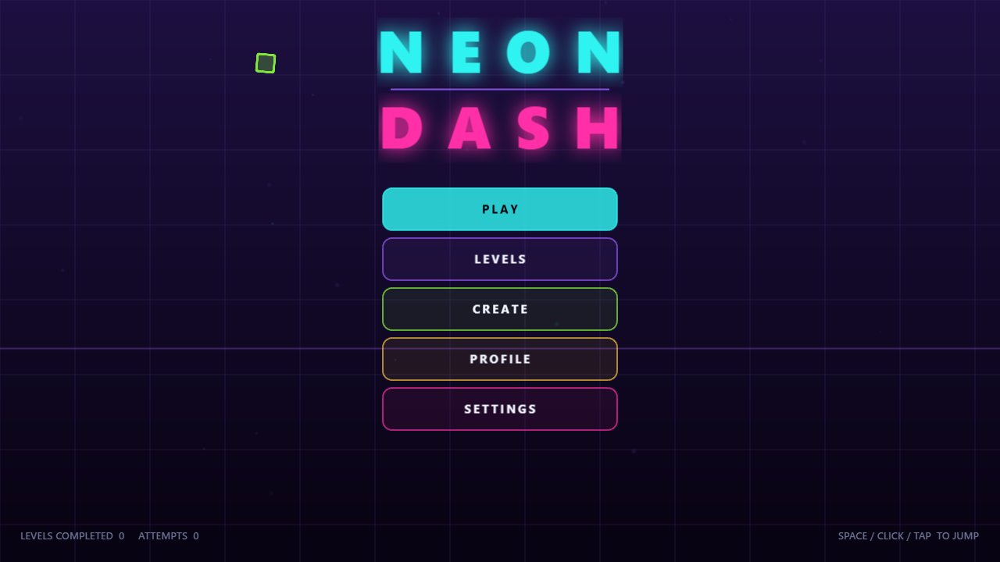
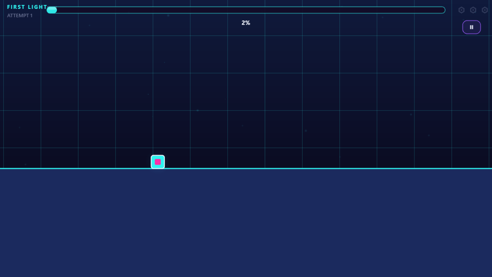
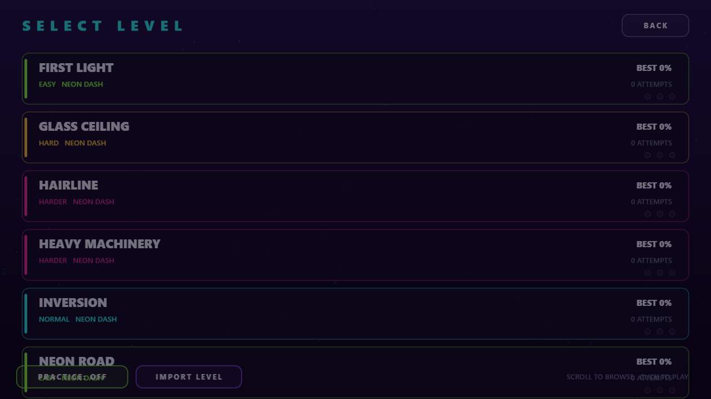
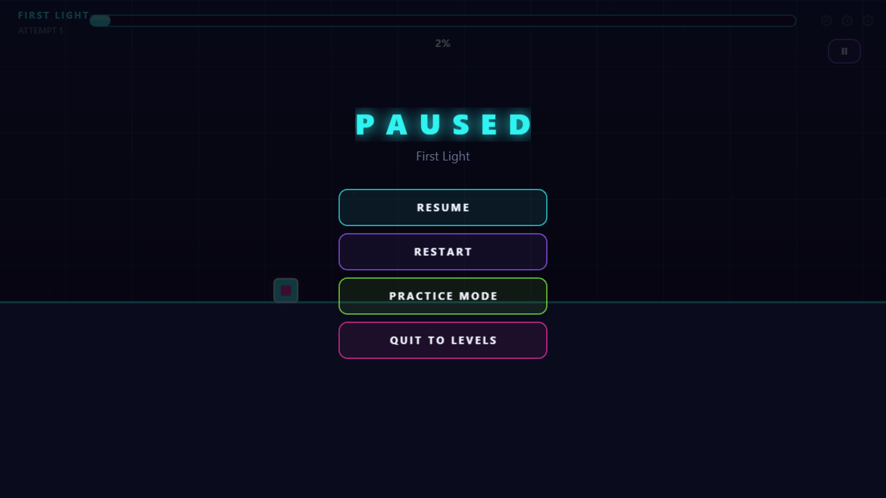
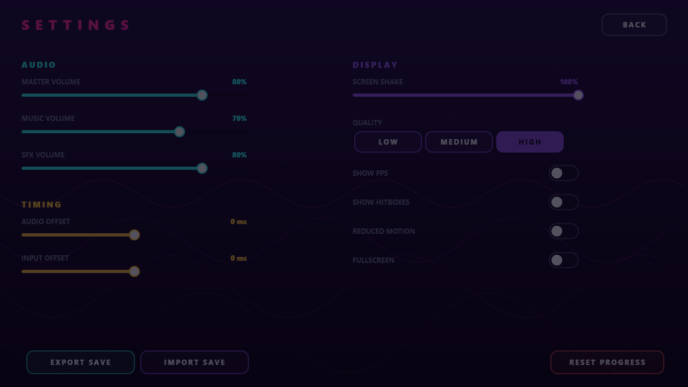
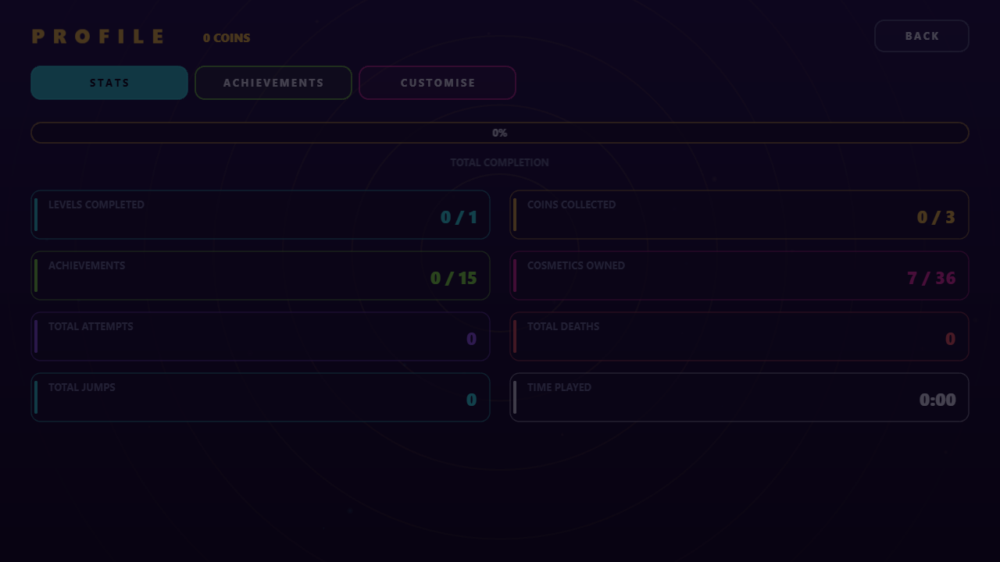
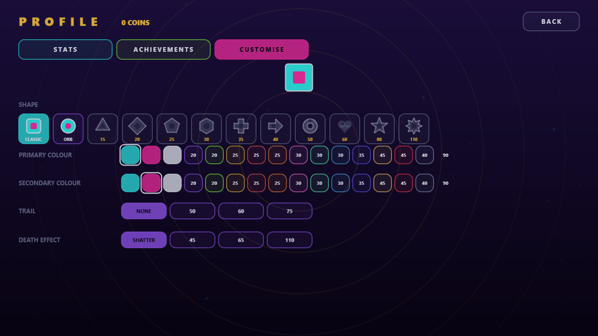
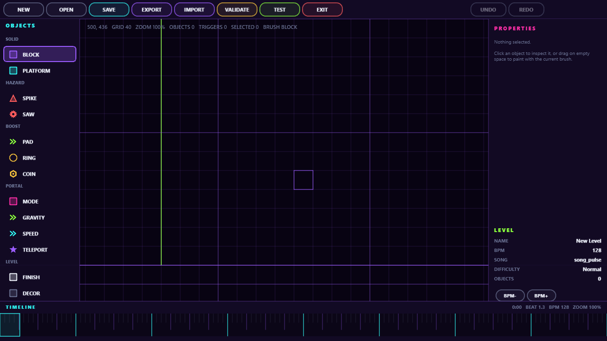

# NEON DASH

An original 2D rhythm platformer in the Geometry Dash genre — run, jump and
fly through neon geometry synced to the beat. Every asset is generated at
runtime: **no image or audio files ship with the game.** Art is drawn with
Canvas 2D primitives, and every track is synthesized in-browser with the Web
Audio API.

Built with **TypeScript, Phaser 3, Vite and the Web Audio API** — no Unity,
no Unreal, no commercial engine.

<p align="center">
  
  
</p>

## Screenshots

|                                                                           |                                                              |
| ------------------------------------------------------------------------- | ------------------------------------------------------------ |
| **Main menu** — procedurally animated grid backdrop                       | **Level select** — 10 levels, difficulty color-coded         |
|                            |         |
| **Gameplay** — fixed-timestep simulation, live HUD                        | **Pause menu** — resume, restart, practice mode              |
|                              |             |
| **Settings** — audio, timing offsets, display, save export/import         | **Profile** — stats, achievements, cosmetics                 |
|                              |             |
| **Customize** — 12 shapes, 16 colors, trails, death effects, live preview | **Level editor** — grid snap, timeline, undo/redo, validator |
|                            |               |

## Play it

```bash
npm install
npm run dev
```

Open the printed `localhost` URL. `Space` / click / tap to jump; hold for
modes that fly instead.

## Features

- **7 game modes** — Cube, Ship, Ball, UFO, Wave, Robot, Swing — each with
  its own physics, switched mid-level by portals
- **10 original levels**, difficulty Easy → Insane, each with its own
  procedurally-composed track
- **In-browser level editor** — object palette, grid snap, drag/rotate/
  resize, undo/redo, copy/paste, a beat-synced timeline, a validator that
  checks a level is actually completable, and instant playtesting
- **Practice mode** with placeable checkpoints
- **Player customization** — 12 shapes and 16 colors (unlocked with in-game
  coins or achievements), plus trails and death effects, all live-previewed
  with the exact code the game renders with
- **Achievements** and a persistent save (export/import as JSON, versioned
  migration for old saves)
- Runs at a fixed **240 Hz simulation step**, decoupled from the render
  loop, so physics are identical regardless of frame rate — and replayable,
  which is what the (not-yet-deployed) online leaderboard design depends on

## Commands

```bash
npm run dev            # Vite dev server
npm run build           # tsc --noEmit && vite build -> dist/
npm run preview          # preview the production build
npm run typecheck       # tsc --noEmit only
npm test               # vitest run (all unit tests, once)
npm run test:watch     # vitest watch mode
npm run lint           # eslint .
npm run lint:fix        # eslint . --fix
npm run format          # prettier --write
npm run levels          # regenerate public/levels/*.json from src/levels/officialLevels.ts
```

## Architecture

The full breakdown of how the pieces fit together — the fixed-timestep
simulation, the audio-clock-driven beat sync, the data-driven game modes and
obstacles, the shared level format between gameplay and the editor — lives in
[CLAUDE.md](CLAUDE.md).

In short: `src/player/` runs a deterministic physics simulation at a fixed
rate; `src/gameModes/` and `src/obstacles/` are table-driven registries, not
`if/else` chains; `src/levels/LevelBuilder.ts` is the DSL the 10 shipped
levels are authored with; `src/editor/` edits that exact same level format;
and `src/audio/` derives every beat and bar from the music's own playback
clock rather than a timer, so a dropped frame delays a visual cue but never
desyncs it.

## Tech stack

|             |                                                      |
| ----------- | ---------------------------------------------------- |
| Language    | TypeScript (strict mode)                             |
| Engine      | Phaser 3 (WebGL/Canvas)                              |
| Build       | Vite                                                 |
| Audio       | Web Audio API (procedural synthesis, no audio files) |
| Art         | Canvas 2D (procedural textures, no image files)      |
| Tests       | Vitest                                               |
| Lint/format | ESLint + Prettier                                    |

## License

MIT
